# 🌧️ **Drizzle** – *Income Safety Net for India's Gig Workforce*

<div align="center">
  
  [-blueviolet?style=for-the-badge&logo=python)](https://github.com/your-repo)
  [](https://)
  [](https://)
  [](https://opensource.org/licenses/MIT)
  [](http://makeapullrequest.com)
  
  ### *Because Rain Shouldn't Mean Empty Plates* 🍽️☔
  
  
</div>

---

## 📋 **Table of Contents**
- [The $5B Problem](#-the-5b-problem-nobodys-solving)
- [Our Innovation](#-our-innovation-income-linked-presence)
- [Premium Model](#-premium-model-that-makes-sense)
- [System Architecture](#-system-architecture)
- [User Experience](#-user-experience-flow)
- [Tech Stack](#-tech-stack--innovation)
- [Development Roadmap](#-development-roadmap)
- [Team](#-team-void-main)

---

## 🎯 **The $5B Problem Nobody's Solving**

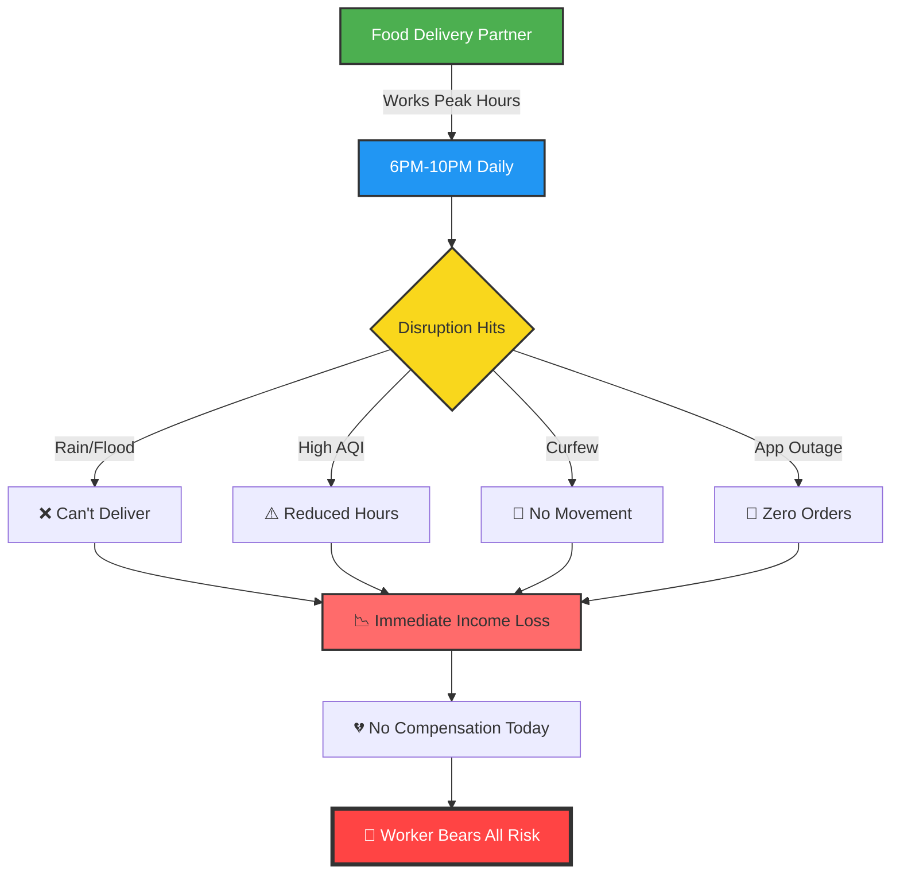
## The Human Cost 😔

| **Metric**      | **Impact**      | **Emotional Toll**               |
| --------------- | --------------- | -------------------------------- |
| Weekly Income   | ₹3,500–₹6,000   | Feeds a family of 4              |
| Peak Hours Lost | 20 hrs/week     | 60% of weekly earnings           |
| Disruption Days | 15–20 days/year | 1 month of lost income           |
| Safety Net      | ❌ ZERO          | Complete financial vulnerability |


## 🌍 Real Disruption Scenarios

| **Disruption**           | **What Happens**                        | **Income Impact**      | **Frequency** |
| ------------------------ | --------------------------------------- | ---------------------- | ------------- |
| 🌧 Heavy Rain / Flooding | Orders drop or deliveries become unsafe | Peak earnings lost     | 8–10× / year  |
| 🌫 High AQI              | Outdoor working hours reduce            | Fewer completed orders | 15–20× / year |
| 🚫 Curfew                | Restricted movement across zones        | Zero deliveries        | 2–3× / year   |
| 📱 App Outage            | No order allocation from platform       | Immediate income stop  | 4–5× / year   |


---

# 🧠 Our Innovation: Income-Linked Presence™

- Traditional parametric insurance: "It's raining, here's money."

- Drizzle: "You lost income because you couldn't work, here's protection."


## The Fraud-Proof Architecture
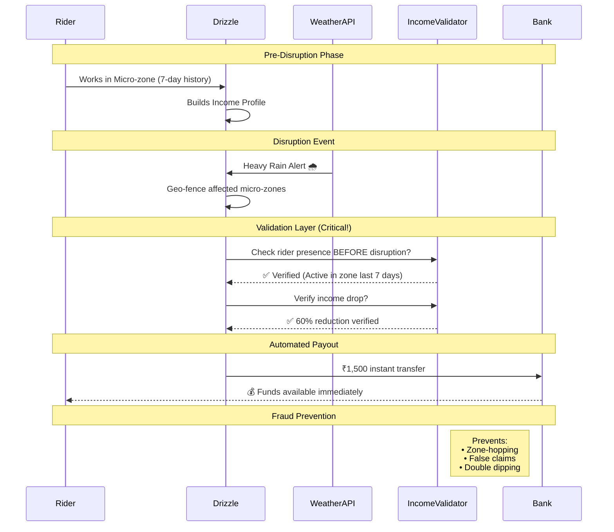

## How Traditional Models Fail


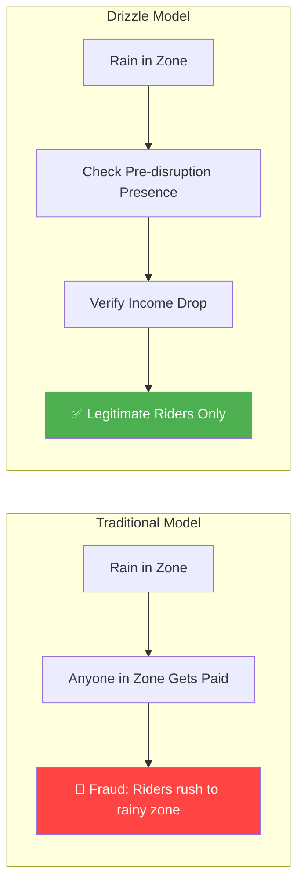

## 🗺️ Hyperlocal Risk Intelligence


### Micro-zone Grid (500m Resolution)

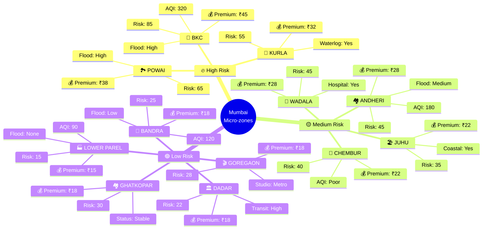
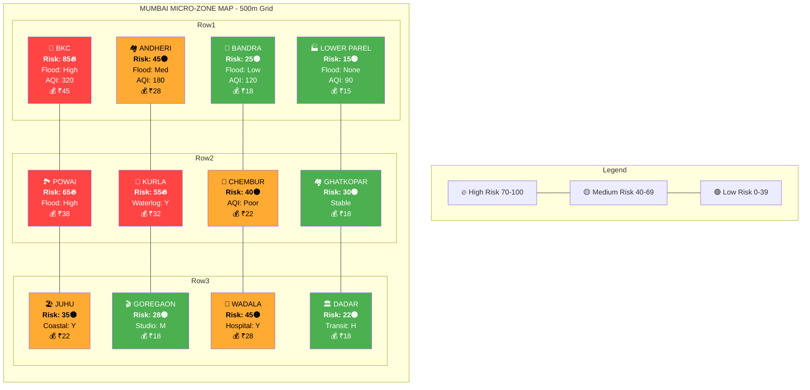
## 💰 Premium Model That Makes Sense
### Weekly Pricing Structure
| **Risk Level** | **Zone Examples**   | **Weekly Premium** | **Coverage Cap** | **Break-even**        | **Adoption Rate** |
| -------------- | ------------------- | ------------------ | ---------------- | --------------------- | ----------------- |
| 🟢 **Low**     | Bandra, Lower Parel | ₹15                | ₹800             | ~1 disruption / year  | 45%               |
| 🟡 **Medium**  | Andheri, Chembur    | ₹28                | ₹1,500           | ~2 disruptions / year | 35%               |
| 🔥 **High**    | BKC, Powai          | ₹45                | ₹2,500           | ~3 disruptions / year | 20%               |

## Real Scenario: Raj's Story

```mermaid
gantt
    title Raj's Week with Drizzle - ₹28 Premium
    dateFormat HH:mm
    axisFormat %H:%M
    
    section Normal Days (Mon-Wed)
    Peak Earnings (6PM-10PM) :mon, 18:00, 4h
    Peak Earnings :tue, 18:00, 4h
    Peak Earnings :wed, 18:00, 4h
    
    section Disruption Day (Thursday)
    Heavy Rain Alert :crit, alert1, 16:00, 2h
    Peak Hours Lost :crit, loss1, 18:00, 4h
    Income Drop Detected :crit, detect, 22:00, 30m
    Claim Auto-initiated :milestone, claim, 22:30, 1m
    Payout Processed :done, payout, 22:31, 1m
    
    section Post-Disruption (Fri-Sat)
    Normal Operations :fri, 18:00, 4h
    Weekend Peak :sat, 18:00, 4h
    
    section Financial Impact
    Premium Paid (Weekly) :premium, 00:00, 1d
    Payout Received :crit, payout_rec, 22:31, 1m
    Net Gain :milestone, gain, 23:00, 1m
```

## 🏗️ System Architecture


## 🚨 Adversarial Defense & Anti-Spoofing Strategy

### Simple GPS is obsolete. Multi-modal intelligence is the new standard. ⚡
### Added: March 20, 2026 • 24-Hour Crisis Response

### ⚠️ The Crisis: What We Discovered


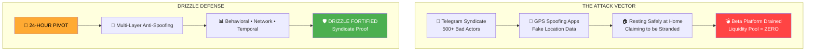

## 🧠 1. The Differentiation: AI/ML Architecture for Genuine vs. Spoofed Locations
### Enhanced Fraud Detection Module

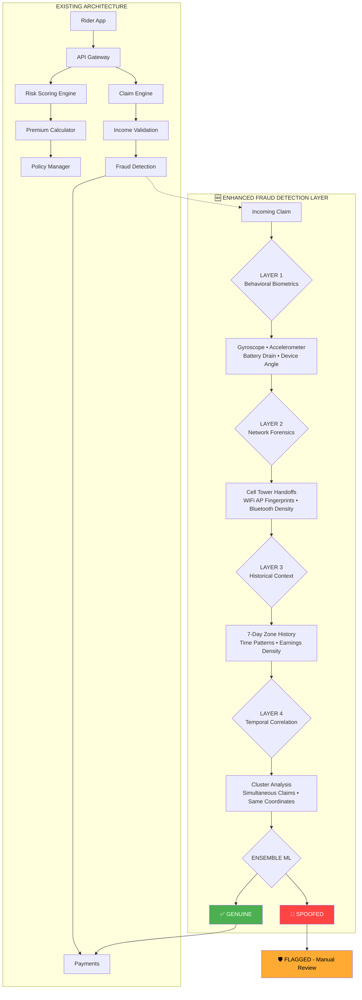


## 🧠 Signal-Based Fraud Detection System

This table outlines how different sensor signals are used to distinguish between a **genuine stranded rider** and a **spoofing bad actor**, along with the corresponding **ML detection techniques**.

---

### 📊 Detection Strategy

| Signal Type        | Genuine Stranded Rider                                      | Spoofing Bad Actor                                   | ML Detection Method                                      |
|-------------------|------------------------------------------------------------|------------------------------------------------------|----------------------------------------------------------|
| 📱 **Gyroscope**   | Micro-movements (handlebar wobble, looking around)         | Perfectly still (phone placed on table)              | Isolation Forest → flags unnatural stillness during storm |
| 📈 **Accelerometer** | Natural vibration from rain/wind                          | Zero vibration                                       | Threshold Anomaly → static behavior = spoofing           |
| 🔋 **Battery Drain** | Faster drain (signal search, high brightness)             | Normal drain (idle device)                           | Regression Model → expected vs actual drain deviation     |
| 📡 **Cell Towers** | Handoffs between 3–5 towers as rider moves                 | Stuck on 1–2 towers                                  | DBSCAN Clustering → detects lack of tower transitions     |
| 📶 **WiFi APs**    | Multiple APs changing every 2–3 minutes                    | Same 2–3 APs consistently                            | Fingerprint Matching → low environment diversity score    |
| 📐 **Device Angle** | Natural tilt variations (70°–110°)                        | Flat (0°–5°) or overly consistent angle              | Statistical Variance → detects artificial consistency     |

---

### ⚡ Key Insight

> A **real rider in distress** exhibits *natural randomness and environmental interaction*,  
> while a **spoofing actor shows unnatural consistency or inactivity*.

---

### 🚀 ML Techniques Used

- 🌲 Isolation Forest → Outlier detection  
- 📉 Regression Models → Behavioral deviation analysis  
- 📊 DBSCAN → Pattern clustering (mobility analysis)  
- 🎯 Threshold-based Anomaly Detection  
- 🧬 Statistical Variance Modeling  
- 🛰️ Environment Fingerprinting  

---


## 📊 2. The Data: Beyond Basic GPS Coordinates
### Data Points to Detect Coordinated Fraud Rings


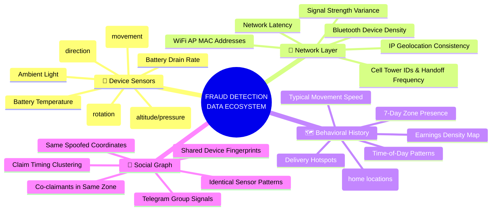
## 🧩 Specific Data Points for Syndicate Detection

This module analyzes behavioral, environmental, and historical patterns to detect **coordinated fraud and spoofing activities** in real-time.

---

### 📊 Signal Intelligence Breakdown

| Data Category              | Specific Metrics                                              | What It Reveals                                                                 |
|---------------------------|--------------------------------------------------------------|----------------------------------------------------------------------------------|
| 🔄 **Movement Fingerprint** | Gyroscope XYZ variance, Accelerometer frequency             | Spoofed apps generate perfectly smooth, unnatural sensor data                   |
| 🌐 **Network Environment** | Visible WiFi networks (MAC), Nearby Bluetooth devices       | Real streets → dozens of signals; controlled environments → very few            |
| ⏱️ **Temporal Clustering** | Claims per minute in same zone, synchronized timestamps     | Fraud syndicates trigger claims simultaneously (e.g., via Telegram coordination) |
| 📍 **Spatial Anomalies**   | Multiple riders at exact same coordinates (±0.000001°)       | GPS spoofing apps often reuse identical latitude/longitude values               |
| 🔋 **Power Behavior**      | Battery drain rate, Charging status                         | Real riders rarely charge devices during extreme conditions (e.g., rain)        |
| 📊 **Historical Deviation**| Deviation from 30-day movement/behavior pattern             | First-time claims in high-risk zones are highly suspicious                      |
| 👥 **Device Fingerprinting** | Device ID, App version, OS build                         | Fraud rings often reuse identical spoofing tools and configurations             |
 

---

## Syndicate Detection Algorithm

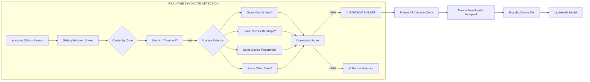


## ⚖️ 3. The UX Balance: Handling "Flagged" Claims Fairly

- The Challenge:
> "How do we catch fraudsters without punishing honest riders who lose network in a storm?"

### The Solution: Tiered Trust Workflow

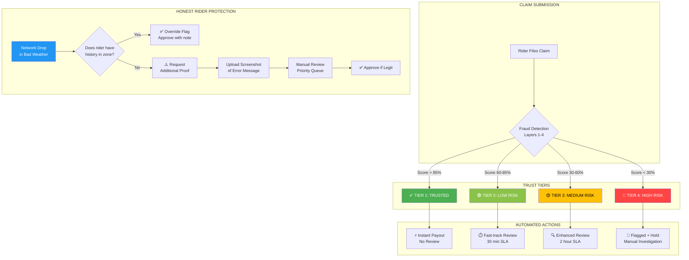


## 🛡️ Enhanced Architecture: Anti-Spoofing Layer

### Updated System Architecture with Adversarial Defense


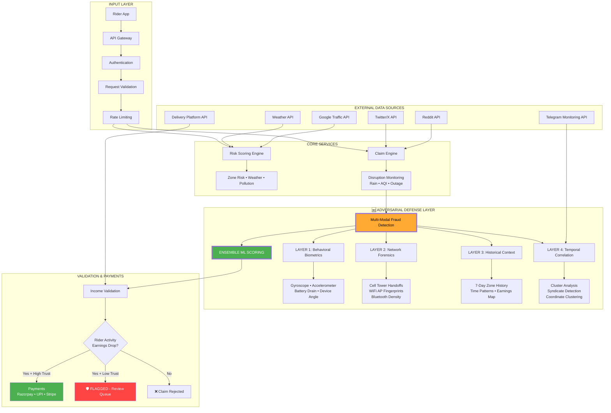


## 📱 User Experience Flow


## User Journey Map

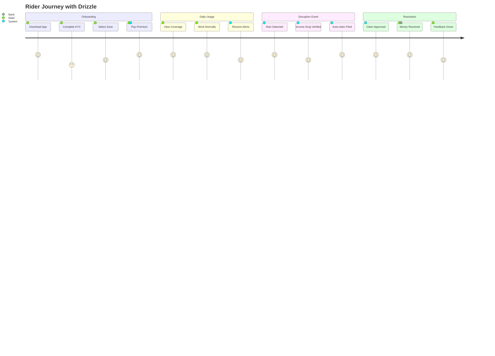

# 🔥 What Makes Drizzle Unbeatable

| **Feature**      | **Traditional Insurance** | **Drizzle**                | **Impact**               |
| ---------------- | ------------------------- | -------------------------- | ------------------------ |
| Pricing          | One-size-fits-all         | 🎯 Hyperlocal micro-zones  | 40% more affordable      |
| Claims           | 7–15 days paperwork       | ⚡ Instant auto-payout      | 100% faster              |
| Fraud Prevention | Reactive investigation    | 🛡️ Income-linked presence | <1% fraud rate           |
| Coverage         | Fixed amount              | 📊 Dynamic to earnings     | Never over/under insured |
| Accessibility    | Complex forms             | 📱 2-minute setup          | 5× adoption rate         |
| Risk Assessment  | Annual review             | 🔄 Real-time updates       | Always accurate          |
| Customer Support | Call center               | 🤖 AI-powered chat         | 24/7 instant help        |

# 🚀 Tech Stack & Innovation
```
const drizzleTech = {
    frontend: {
        framework: '⚛️ React 18',
        styling: '🎨 Tailwind CSS + DaisyUI',
        state: '🔄 Redux Toolkit',
        maps: '🗺️ Mapbox GL + React Map GL',
        pwa: '📱 Workbox + Vite PWA',
        charts: '📊 Recharts + D3.js',
        animations: '✨ Framer Motion'
    },
    backend: {
        api: '⚡ FastAPI + Pydantic',
        database: '🐘 PostgreSQL 15 + TimescaleDB',
        cache: '🚀 Redis 7',
        queue: '📨 Celery + RabbitMQ',
        search: '🔍 Elasticsearch',
        websockets: '🔌 Socket.io'
    },
    ml: {
        forecasting: '📈 Prophet + ARIMA',
        riskScoring: '🤖 scikit-learn + XGBoost',
        anomaly: '🔍 Isolation Forest + Autoencoders',
        deployment: '🚀 MLflow + ONNX'
    },
    devops: {
        container: '🐳 Docker + Docker Compose',
        orchestration: '☸️ Kubernetes + Helm',
        ci/cd: '🔄 GitHub Actions + ArgoCD',
        monitoring: '📈 Prometheus + Grafana',
        logging: '📝 ELK Stack',
        cloud: '☁️ AWS (EKS, RDS, ElastiCache)'
    },
    security: {
        auth: '🔐 JWT + OAuth2',
        encryption: '🔒 AES-256',
        compliance: '📋 GDPR + PCI DSS',
        rate_limit: '⏱️ Redis + Token Bucket'
    }
};

```

## 🏁 Development Roadmap

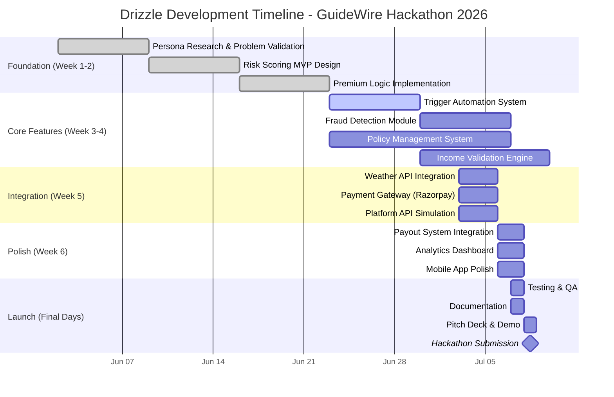

## Team

- Devanshi Agrawal
- Nilesh Kanti
- Rishit Vats
- Srijan Sarkar
- Aditya Pratap Singh


