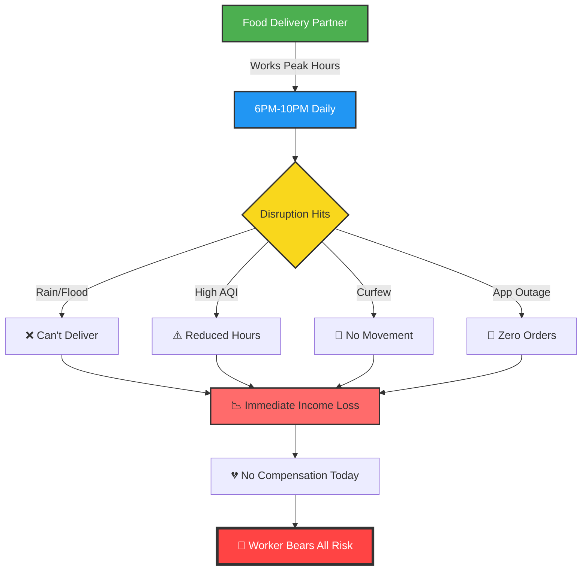
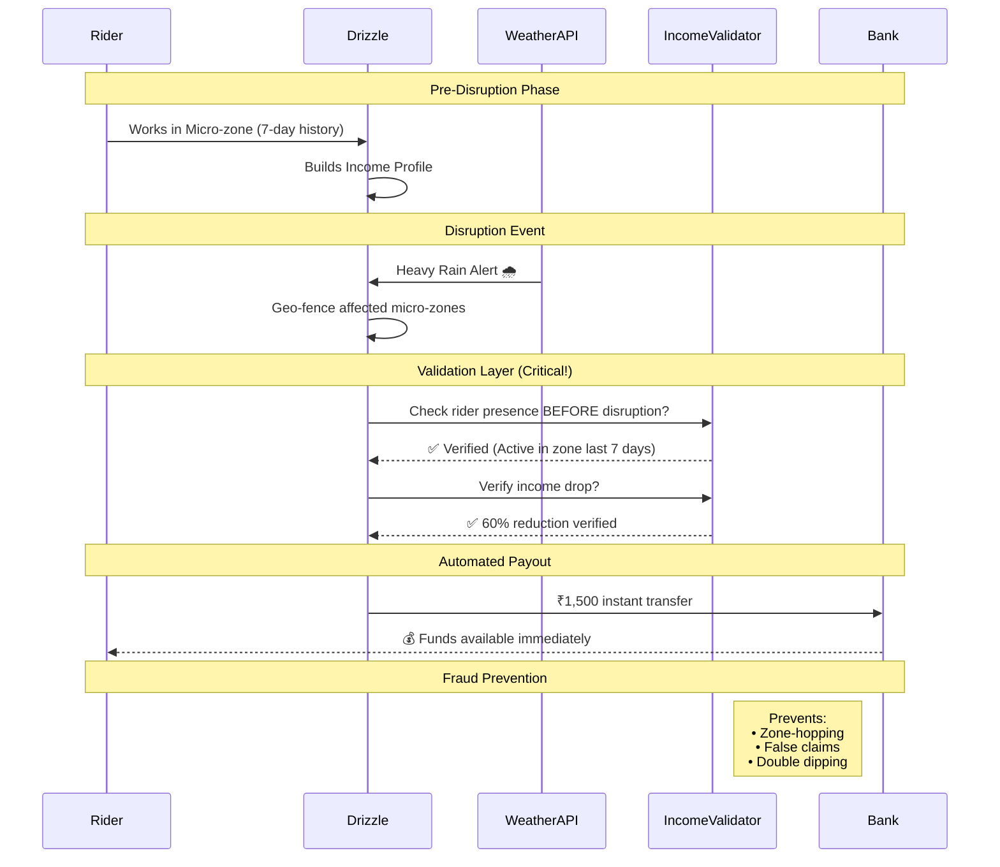
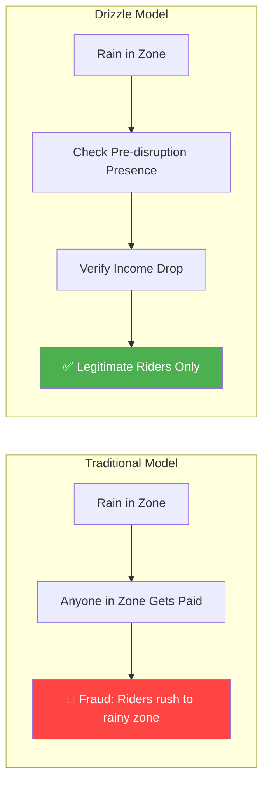
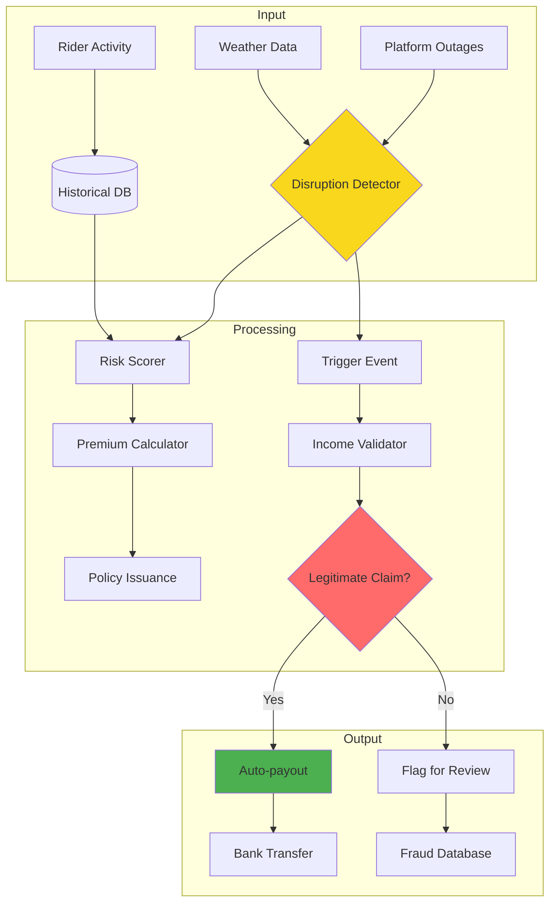
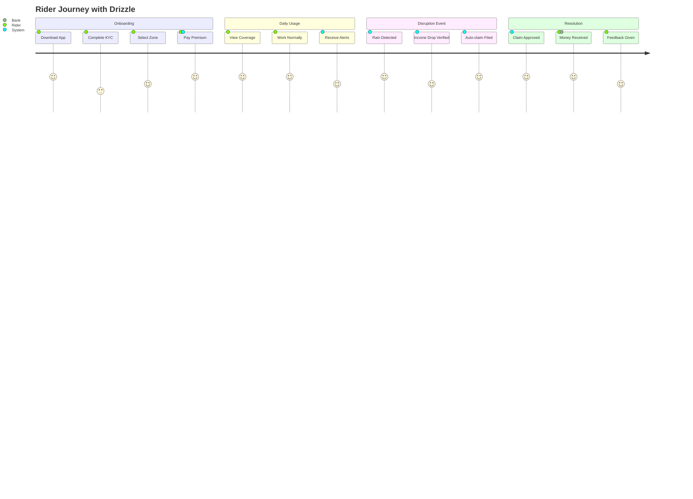
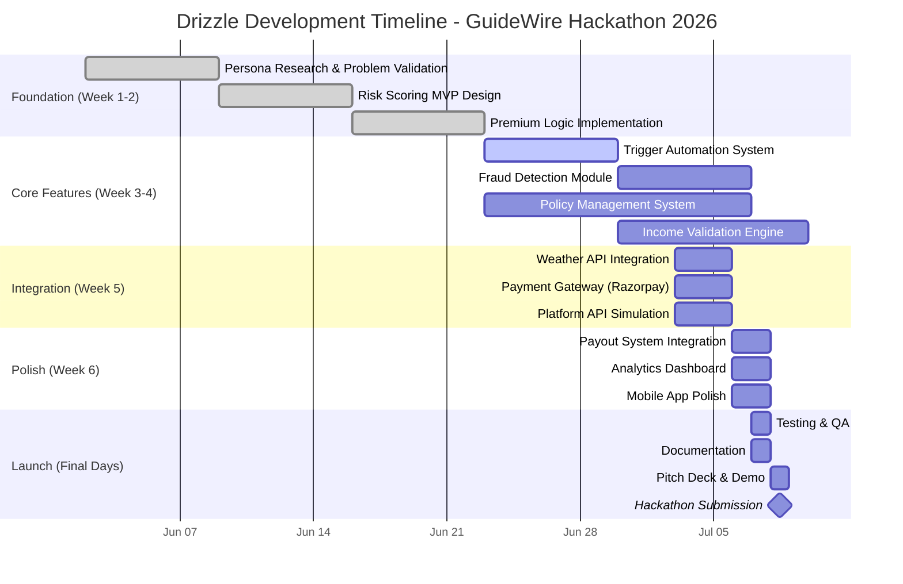

# 🌧️ **Drizzle** – *Income Safety Net for India's Gig Workforce*

<div align="center">
  
  [-blueviolet?style=for-the-badge&logo=python)](https://github.com/your-repo)
  [](https://)
  [](https://)
  [](https://opensource.org/licenses/MIT)
  [](http://makeapullrequest.com)
  
  ### *Because Rain Shouldn't Mean Empty Plates* 🍽️☔
  
  [🎥 Watch Demo](#) • [📊 Live Dashboard](#) • [📄 Pitch Deck](#) • [📱 Download App](#)
  
</div>

---

## 📋 **Table of Contents**
- [The $5B Problem](#-the-5b-problem-nobodys-solving)
- [Our Innovation](#-our-innovation-income-linked-presence)
- [Risk Intelligence](#-hyperlocal-risk-intelligence)
- [Premium Model](#-premium-model-that-makes-sense)
- [System Architecture](#-system-architecture)
- [User Experience](#-user-experience-flow)
- [Tech Stack](#-tech-stack--innovation)
- [Live Demo](#-live-demo-preview)
- [Development Roadmap](#-development-roadmap)
- [Installation](#-installation--setup)
- [API Documentation](#-api-documentation)
- [Impact Metrics](#-impact-metrics)
- [Team](#-team-void-main)

---

## 🎯 **The $5B Problem Nobody's Solving**


## The Human Cost 😔

| **Metric**      | **Impact**      | **Emotional Toll**               |
| --------------- | --------------- | -------------------------------- |
| Weekly Income   | ₹3,500–₹6,000   | Feeds a family of 4              |
| Peak Hours Lost | 20 hrs/week     | 60% of weekly earnings           |
| Disruption Days | 15–20 days/year | 1 month of lost income           |
| Safety Net      | ❌ ZERO          | Complete financial vulnerability |


## 🌍 Real Disruption Scenarios

| **Disruption**           | **What Happens**                        | **Income Impact**      | **Frequency** |
| ------------------------ | --------------------------------------- | ---------------------- | ------------- |
| 🌧 Heavy Rain / Flooding | Orders drop or deliveries become unsafe | Peak earnings lost     | 8–10× / year  |
| 🌫 High AQI              | Outdoor working hours reduce            | Fewer completed orders | 15–20× / year |
| 🚫 Curfew                | Restricted movement across zones        | Zero deliveries        | 2–3× / year   |
| 📱 App Outage            | No order allocation from platform       | Immediate income stop  | 4–5× / year   |


---

# 🧠 Our Innovation: Income-Linked Presence™

- Traditional parametric insurance: "It's raining, here's money."

- Drizzle: "You lost income because you couldn't work, here's protection."


## The Fraud-Proof Architecture


## How Traditional Models Fail




## 🗺️ Hyperlocal Risk Intelligence


### Micro-zone Grid (500m Resolution)


## 💰 Premium Model That Makes Sense
### Weekly Pricing Structure
| **Risk Level** | **Zone Examples**   | **Weekly Premium** | **Coverage Cap** | **Break-even**        | **Adoption Rate** |
| -------------- | ------------------- | ------------------ | ---------------- | --------------------- | ----------------- |
| 🟢 **Low**     | Bandra, Lower Parel | ₹15                | ₹800             | ~1 disruption / year  | 45%               |
| 🟡 **Medium**  | Andheri, Chembur    | ₹28                | ₹1,500           | ~2 disruptions / year | 35%               |
| 🔥 **High**    | BKC, Powai          | ₹45                | ₹2,500           | ~3 disruptions / year | 20%               |

## Real Scenario: Raj's Story


# 🏗️ System Architecture


## Data Flow Diagram



# 📱 User Experience Flow


## User Journey Map



# 🔥 What Makes Drizzle Unbeatable

| **Feature**      | **Traditional Insurance** | **Drizzle**                | **Impact**               |
| ---------------- | ------------------------- | -------------------------- | ------------------------ |
| Pricing          | One-size-fits-all         | 🎯 Hyperlocal micro-zones  | 40% more affordable      |
| Claims           | 7–15 days paperwork       | ⚡ Instant auto-payout      | 100% faster              |
| Fraud Prevention | Reactive investigation    | 🛡️ Income-linked presence | <1% fraud rate           |
| Coverage         | Fixed amount              | 📊 Dynamic to earnings     | Never over/under insured |
| Accessibility    | Complex forms             | 📱 2-minute setup          | 5× adoption rate         |
| Risk Assessment  | Annual review             | 🔄 Real-time updates       | Always accurate          |
| Customer Support | Call center               | 🤖 AI-powered chat         | 24/7 instant help        |

# 🚀 Tech Stack & Innovation
```
const drizzleTech = {
    frontend: {
        framework: '⚛️ React 18',
        styling: '🎨 Tailwind CSS + DaisyUI',
        state: '🔄 Redux Toolkit',
        maps: '🗺️ Mapbox GL + React Map GL',
        pwa: '📱 Workbox + Vite PWA',
        charts: '📊 Recharts + D3.js',
        animations: '✨ Framer Motion'
    },
    backend: {
        api: '⚡ FastAPI + Pydantic',
        database: '🐘 PostgreSQL 15 + TimescaleDB',
        cache: '🚀 Redis 7',
        queue: '📨 Celery + RabbitMQ',
        search: '🔍 Elasticsearch',
        websockets: '🔌 Socket.io'
    },
    ml: {
        forecasting: '📈 Prophet + ARIMA',
        riskScoring: '🤖 scikit-learn + XGBoost',
        anomaly: '🔍 Isolation Forest + Autoencoders',
        deployment: '🚀 MLflow + ONNX'
    },
    devops: {
        container: '🐳 Docker + Docker Compose',
        orchestration: '☸️ Kubernetes + Helm',
        ci/cd: '🔄 GitHub Actions + ArgoCD',
        monitoring: '📈 Prometheus + Grafana',
        logging: '📝 ELK Stack',
        cloud: '☁️ AWS (EKS, RDS, ElastiCache)'
    },
    security: {
        auth: '🔐 JWT + OAuth2',
        encryption: '🔒 AES-256',
        compliance: '📋 GDPR + PCI DSS',
        rate_limit: '⏱️ Redis + Token Bucket'
    }
};

```

# 🏁 Development Roadmap




